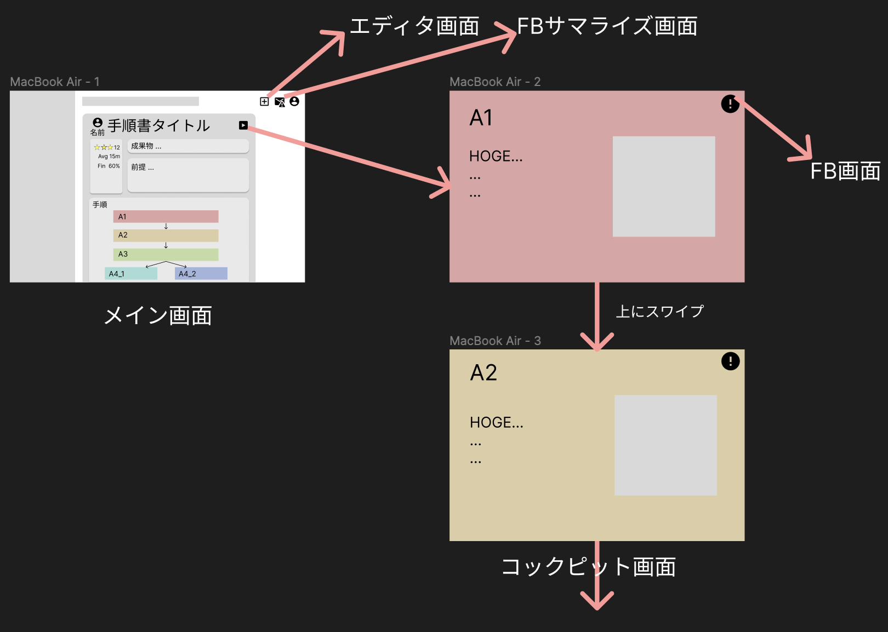
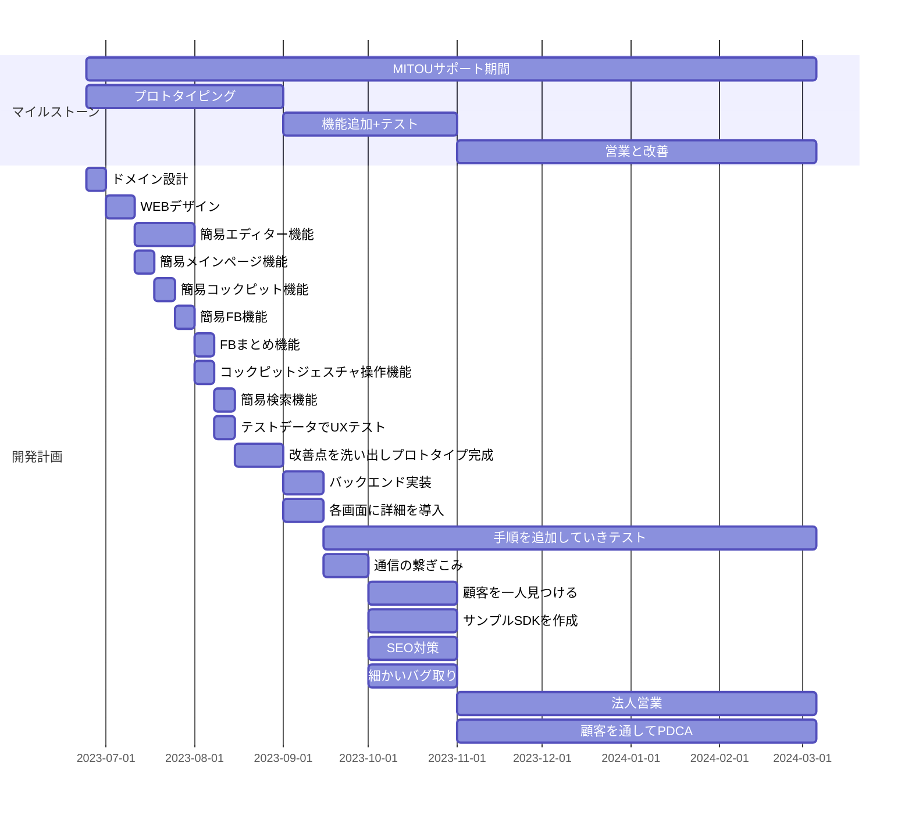

<!-- 
# TODO

- [ ] 適宜ボールド体を入れて強調する
- [ ] サービスのイメージ図を入れて、読者にすぐ伝わるようにする

具体的に役に立って市場競争力を持つ例
- 計測可能な量から推定量を出して、それを使って続きの作業をする場合
- 測定結果の記録までを標準化できるたり、それを用いた安全検定資料の作成などができる。
- 機械がある設定で待ち構えてくれたり、機械同士が通信して、設定を合わせてくれたりすることで、滞りなく生産ができる。例えば、料理で言う余熱とか。
- やるべきタスクの管理を機械が制御して指示してくれる。例えば、家を建てるときなど。
- 機械の設定値について、現場の職人の勘を明文化させて、組織として知見を共有する
- 作るべき部品の詳細がいつでも見れる場所にあるとか、詳細がわからないときすぐに聞くことができるとか
  
情報を発信する側と情報が欲しい側の要件は違う
法律が絡んだりする領域では手順書が仕事をしている
僕が作ろうとしているのは、手順書なのか？プロセス書という名のエージェントプログラミングでは？
-->

<link rel="stylesheet" href="style.css"/>

プロジェクト名: 「人と機械が巧みに協調するためのデジタル手順書プラットフォーム」  
申請者名: 奥村英貴, 浦川樹

# なにをつくるか

<!-- > 提案の背景、目的、目標を、その分野の専門家でない人にもわかるように丁寧に記述してください。 -->

　日本は少子高齢化の結果、2050年には人口は9000万人程度、生産年齢人口は3000万人程度にまで減少することが見込まれている。そのため、より効率的な事業形態の検討が広く進められており、ソフトウェアを活用するDXといったトレンドが生まれた。しかし、運送業や大量生産現場といった市場規模が大きくトップダウンな施策が進めやすい領域に対して効率化の知恵が集中する中、日本の工業生産の競争力として活躍してきた中小企業、多品種少量生産の現場に対しては十分な手が打たれているとは言えない。そこで、彼らを含む一般の人たちが自発的に生産改善、改革を進める、ボトムアップな効率化が進むような土壌を整えることを目的として、人間だけでなく機械とも容易に協調して作業を実施できるデジタル手順書を考案し、本プロジェクトではデジタル手順書を容易に執筆、実行、共有、改善することができるプラットフォームを作成することを提案する。このプラットフォームによって、幅広い生産の最前線、例えば料理、建築現場、生産現場において、より機械や計算機を積極的に活用した生産の知恵が生じると共に、その共有が自発的に進むようになり、2050年の生産現場が少人数でも競争力を維持していることを目標とする。

　と社会的な意義をつらつら述べたが、最初の着想は私自身の中にある。料理をする際に、手順を確認するために毎回手を洗うのがめんどくさいという体験だ。これは、手順書を見つつ手が汚れる作業をする方々は皆感じるめんどくささであると思い、それをビジネス展開が可能になるように広げていったのが本提案書の内容である。なので、私が料理をしている時や、母が料理をしている時に使いたくなるようなコックピット機能を作成するという明確な指針のもとで柔軟に開発を進めていきたいと思っている。コックピット機能とデジタル手順書の充実と共に、流入してきたユーザーからデジタル手順書が作成されるようになっていくことが中期的な目標である。長期的には、収集された手順書とそれを実施する人々の動画情報などを統合して、ロボティクスにも応用可能であると考えている。

　以上の目標の実現にあたって、立ちはだかると想定される壁が二つある。一つは、対象とするユーザーがデジタルネイティブ層ではないため、関心を持ってもらうことが容易でないことである。これに対しては、コックピット機能という、手順書の実行に伴走し機械との協調を支援する機能だけは誰でも直感的に利用できるようにし、デジタルネイティブ層でない方々にも便利さと有効性の認知が広まるように徹底することで克服する。もう一つは、想定ユーザーのボリュームは多いが多種多様である点だ。これに対しては、各ドメインごとに特殊な便利さを導入したコックピット機能を実装しつつ、その領域のデジタル手順書の充実を量ることで、少しずつ取り込んでいくことを目指す。

実装にあたって必要だと考えている要件は以下の通りである。

- 各種SDKを活用したデジタル手順書を、容易に執筆可能なエディタ機能
- デジタル手順書の実行を最大限補助するコックピット機能
- デジタル手順書を共有し、組み合わせることができる検索機能
- デジタル手順書の不明点や改善をコメントできるFB機能
- デジタル手順書に寄せられた口コミを概観できるFBサマライズ機能

# どんな出し方を考えているか

<!-- > 提案したプロジェクトの世の中への出し方、問い方について記述してください。(例えば、フリーソフトとして出す、オープンソースソフトウェアとして公表する、ビジネス展開に持ち込む努力をする、など)。 -->

　Webサービスとして、基本無料で一般公開し、ユーザーを増えたら、ビジネス展開に持ち込むことを考えている。

　広報戦略としては、まずコックピット機能をある特定の領域(例えば料理)に特化して便利にしていく。その中で、狙った領域のデジタル手順書を増やしていき、SEOも頑張ることで、ネット検索からの自然な流入を作る。それがうまくいき、コックピット機能を利用する目的で、我々のプラットフォーム上でデジタル手順書が自然に増えていったら、資金を調達し、収益性の目処が立つまで支えてもらい、そこから他の領域にも手を広げていく。

　ビジネスモデルとしては二つある。一つは、デジタル手順書内で利用できる生産機器を製造している会社や特許を保有している会社が我々のプラットフォーム上でSDKを公開したり、広報のためのデジタル手順書を投稿したりすることに対して、成果報酬やサブスクリプションの形で対価をもらうというもの。製造会社は、我々のプラットフォーム上で、製造機器や特許がデジタル手順書をいかに改良するかをアピールすることで、我々のプラットフォームを窓口として顧客を獲得することができる。もう一つは、社内などで閉じたノウハウを共有したい需要は十分あり、彼らに向けてクローズドで安全なSaaSを提供することで、社員数に応じた対価をもらうというもの。Wikiのようなツールでは観測できなかったダイナミックな利活用情報を利用することができ、これによってデジタル手順書の新陳代謝が自然に促されるので、ノウハウの再発明を防ぐことができ、自発的なDXが期待できるというメリットがある。

# 斬新さの主張、期待される効果など

<!-- > 少し背伸びをしてもいいので、自由に記述してください。 -->

本プロダクトの斬新な点は以下の通り。

1. エディタ機能ではなく、コックピット機能に主眼を置いたマニュアルアプリである点
2. 生産技術を生み出す会社にとって自然な顧客導線となる点
3. 全てを自動化するのではなく、ハイブリッドにすることを強調している点
4. あらゆる人々が参画可能で、すべてが公平に比較されるOpenなコミュニティである点

それぞれについて詳細を説明する。

## エディタ機能ではなく、コックピット機能に主眼

　元来トップダウンで導入される業務改善ソフトウェアは手順作成者のUX最大化を目指しているが、むしろ活用する側のUXが最大化されるべきだと考える。そのため、手順書活用者のユースケースを網羅的に理解し、その障壁になりうる要素を徹底的に取り除く。今検討している例として、非接触のインターフェース、特にジェスチャーによる操作の導入がある。これにより、作業途中で手が良ごれてタッチ操作ができないユースケースでも手を洗わずに自然に手順書を操作できるようになる。これらの姿勢と施策によって、プラットフォーム利用者の自発的な拡大が生じ、これによって参加者全体がコミュニティの充実によって利益を得ることが期待できる。

## 生産技術を生み出す会社にとって自然な顧客導線となる

　生産技術、特に生産機器や特許技術などの開発を行う会社は自社のノウハウを外に対してアピールしてく必要があり、そのために、展示会、WEBサイト、エージェントなど様々な手段を投じている。しかし、真摯なノウハウ開発の究極的な成果は、それを利用することによって、利用しない場合に比べてどれぐらい何が改善するのか、である。これを実直にアピールできる場所、それが我々のプラットフォームである。我々のプラットフォームでは、売り出す側が自社ノウハウが効果を上げるデジタル手順書をたくさん公開することで、潜在顧客にリーチすることができる。顧客側は売り出す側のポジショントークだけでなく、実際の口コミを参照することで、他の手段と容易に比較することができる。さらに、その技術を利用したデジタル手順書がユーザー側から提案されることによって、コミュニティ全体がその技術を生かす方法を探究してくれるというメリットもある。

## 人と機械がハイブリッドに働く未来を強調している点

　我々はただのノーコードツールを作りたいわけではない。完全自動化できない領域で、人と機械が限りなく巧みに協調して、いいものを作り出す世の中になる地盤を整えたいのだ。そのために、機械と人間の良き仲介者が必要であり、我々のプラットフォームはそうなると確信している。

## すべてが公平に比較されるOpenなコミュニティである点

　Google検索やYoutube検索によって、さまざまなノウハウに容易に触れられるようになっているが、学者たちがGoogle Scholarを使うのはなぜだろう？それは、論文の検索のために比較要件とGoogle検索の序列アルゴリズムは合致しないからである。比較という作業はドメイン固有の特徴を多く備えている。我々のプラットフォームでは、全てのデジタル手順書がそのドメインにあった形でまるでkakaku.comのように比較される。そのため、活用者はお金によって歪められていない、本当の比較によって目的を達成するデジタル手順書を見つけることができる。また、その投稿はすべての人たちに開かれている！興味深いデジタル手順書は世の中にたくさんあり、ものづくりに関わる人たちの叡智に誰でも触れられる環境を用意することはインターネット文化が急速に発展したのと同じように、生産技術の急速な発展を生み出すと期待している。

# 具体的な進め方と予算

## 主に開発を行う場所

- 京都大学北の奥村英貴の自宅

## 使用する計算機環境(ハード、OS)

- MacBook, OSX

## 使用する言語、ツール

プロトタイプ実装には以下のライブラリを利用して素早く作成することを目指す。

- Backend = Python/Flask, SQL/MySQL
- Web = Typescript/React, Rust/WebAssembly
- Design = Figma
- バージョン管理 = Git
- レポジトリ管理 = Github
- デプロイ先 = AWS

## 各クリエータの作業の分担

- 奥村英貴: Web
- 浦川樹: Backend

適宜お互いの領域にとらわれず実装を進めていくつもりでもある。

## ソフトウェア開発に使う手法

- 慣れているのでGithubフロー
- 最初の基盤となるアプリができるまではウォーターフロー的に進めて、改良する段階に入ったら自ら使いながらアジャイル的に進めていく

## 開発線表

## 開発にかかわる時間帯と時間数

二日/一週間 日中 フルタイム8時間

## 予算内訳をまとめた表

### 収入
| 名前 | 金額 | 備考 |
| :--- | :---: | ---: |
| MITOU支援金 | 2,368,000¥ | = (38週 * 2日/週 * 8h/日 * 2000¥/h) * 2人 |

### 支出
| 名前 | 金額 | 備考 |
| :--- | :---: | ---: |
| AWS利用料 | 150,000¥ |  |
| 法人営業に向かうための交通費 | 150,000¥ |  |
| SEO対策勉強代 | 50,000¥ |  |
| 合計 | 350,000¥ | |

# 提案者の腕前を証明できるもの

<!-- > 提案者がプログラミングに関してどんなスキルをもっているか、記述してください。
グループによる提案の場合は、クリエータとなるメンバー全員について記述してください。 -->

## 奥村英貴

- [Linkedin](https://www.linkedin.com/in/hideki-okumura-info/)

1. 大学入学と同時にJavaプログラミングを始める。ブロック崩しを作る
2. C#によるCADアドイン開発バイトを一年半程度行なってOOPについて学ぶ
3. C++で競技プログラミングに精進し、入水手前まで精進(https://atcoder.jp/users/hideki)
4. ruiさんのブログに触発され、CコンパイラをCで実装。プリプロセッサを実装し切るも、セルフコンパイルには失敗(https://github.com/hideki1217/selfcc)
5. Rustで準同型暗号エンジンを実装し、パフォーマンスと可読性の両立に悩む(https://github.com/hideki1217/rustTfhe)
6. CUDAでDNNアクセラレータシミュレータを高速化し、メモリ管理など低レイヤーに対する気遣いを理解(https://github.com/hideki1217/matmul_hpc)
7. 就活を機にReact/ReactNativeなどに入門し、チームでドライバー向け配送アプリ(at LINEハッカソン)や釣り動画検知ChromeExtension(at ハックツハッカソン)を実装。ビジネスの視点を学ぶ。

## 浦川樹

TODO

# プロジェクト遂行にあたっての特記事項

<!-- > 学業、仕事との両立や関係、環境が変わる可能性等、特殊な事情があれば記述してくださ
   い。
大学生・大学院生の場合、プロジェクト期間中に在籍する研究室がある場合は、その情報を 記述するようにしてください。 -->

## 奥村英貴

京都大学大学院情報学研究科先端数理科学専攻非線形物理学講座計算物理コース 修士課程 所属

## 浦川樹

TODO

# 勉強、特技、生活、趣味など

<!-- > 簡潔でよいので自由に記述してください。 -->

## 奥村英貴

- 趣味
  1. ネットゲーム(主にLeague of Legend, Apex Legends)
  2. 読書(詩集以外はなんでも)。本屋カフェによくいく
- 特技
  1. パスタを茹でること
  2. 味関係の利き○○が大体できる(利き水, 利きシロップ, etc...) <- (ﾟДﾟ)ﾊｧ?
- 苦手なこと
  1. 自炊
- 大学院では非線形物理学を専攻、確率統計や確率微分方程式などのモデルになじみがある
- 学部時代に機械学習まわりの数理統計に親しんでいる。学習のためC++でDNNライブラリを実装して研究で使っていた時期もある
- 友人は多くないが、知らない人と話すのは好き

## 浦川樹

TODO

# 将来のソフトウェア技術について

<!-- > 提案内容にとらわれず、自由に記述してください。 -->

## 奥村英貴

　将来のソフトウェア技術について、私はこれからもっともっとソフトウェア技術は多くの人が嗜むものとして普及していくと考えている。その現象が起こる根拠は、学習指導要領の改訂とAIの台頭である。技術科目の導入が若い世代のパソコンへの認知をまし、AIがコンピュータとの触れ合いを支援し、人々がその可能性を認識する機会を増やすと同時に習得のハードルを下げる。結果として、カレイの煮付けからおでんくらいにまで、ソフトウェア技術はぐんぐん民衆化するだろう。

　しかし、この施策によるソフトウェア産業への効果は限定的だと思う。なぜなら、ソフトウェア技術は実装力とソフトウェア的発想に分けられ、上の施策はソフトウェア的発想を育む要素が薄いと感じるからだ。日本人の実装力がアメリカ人より劣っているということは全くないと私は信じている。しかし、ハッカー文化、エレガントな課題解決への積極性の原点は明らかにアメリカにある。実装力は筋肉である。哲学にかられ筋肉を駆動する積極性、執念は脳である。両方がなければ、素晴らしいアスリートにはなれない。

　未踏事業の目的はきっとそこにあるのだが、私が思うに中途半端だ。執念を生み出すのは独創的な個人であり、それを広めるのはコミュニティである。未踏は独創的な個人を選び出し、彼らを未踏OB会に入れ、彼らが道を走り切ることを支え合う。しかし、そうした独創的な個人が信奉者を募ることを積極的に奨励してはいない。未踏事業のさらなる躍進のためには、未踏OBが人を巻き込める場所を用意することも必要であると考える。ぜひ検討していただきたい。<- (ﾟДﾟ)ﾊｧ?

　精神性に絡んで、私自身が気をつけたい点がある。それはハード的産業に対する敬意である。日本国は歴史的にハード的産業、ものづくりで財を成してきた。その中で、昨今のソフトウェア巨人の勃興から、多くの経営者がハードからソフトというような方向性を示している。しかし、ソフトウェアでは実現できない方法で、ハード的産業は競争力を生み出す。一見ローテクに見えるハード的産業技術の多くは他社が真似しようがないものだ。コンピュータは最も制御しやすい対象の一つであることを忘れてはならない。本当に難しいのは、その外にあるのである。

　最後に、私は将来的にAIによる開発支援系が充実することを期待している。人間の指示で動く限り、完璧な実装をこなすAIは登場しないだろう。その修正にはパソコンのドメインが不可欠であり、開発者の仕事が失われることはないと私は楽観的に見ている。しかし、文脈をパソコン内に集約できる領域はAIによる完全実装も可能になるだろう。UIの翻訳、改良、SEOの最適化、コードのリファクタリング、高速化、文書化、アーキテクチャの決定などだ。こうした領域でAIによる開発支援系が充実すれば、プログラマは目的達成のためのドメイン表現とビジネスロジック、そしてAIの上司をやればよくなる。こうした結果、哲学や精神性により一層集中する余裕が生まれ、独創もきっと発揮されやすくなるだろう。

## 浦川樹

