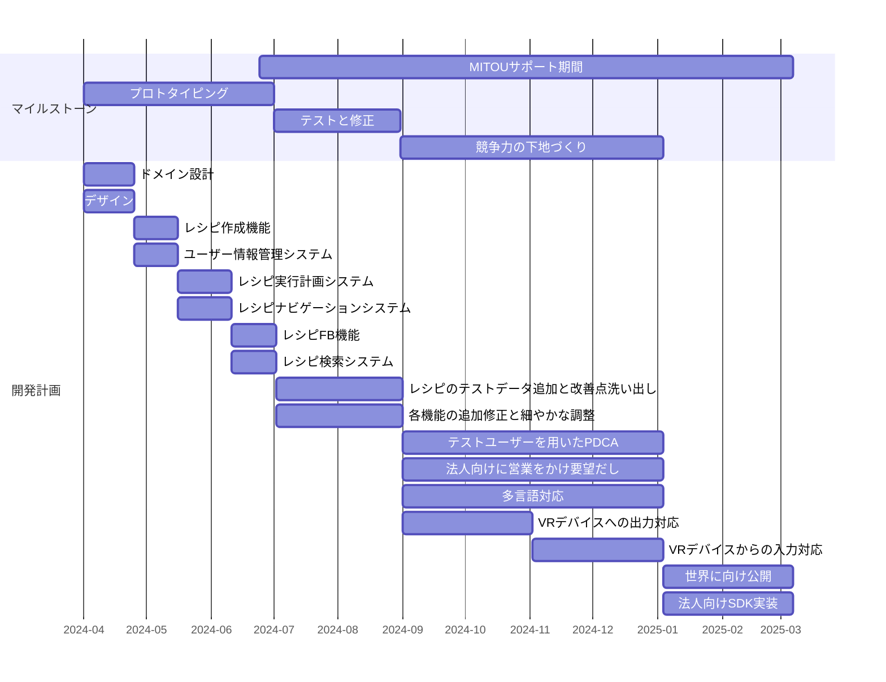

<!-- 
TODO 
- [ ] hoge
- [ ] 
-->

<link rel="stylesheet" href="style.css"/>

プロジェクト名: ユーザーに合わせて自炊を補助するVRを用いた自炊支援システム

申請者名: 奥村英貴、浦川樹

# なにをつくるか

　料理は日々の生活に欠かせない活動である。しかし、多くの人にとって苦手意識のある分野でもある。こうした苦手意識をコンピュータを用いて解決しようと、多くの先行研究がなされてきた。調理工程をグラフの形で表現することで、ユーザーが料理に必要な道具や材料を把握し、調理全体を俯瞰できるようにするシステム[1]や、工程の実行計画を道具や場所のリソース内で計画しユーザーは工程の実行のみに集中できるようにするシステム[2]、調理道具にセンサーを付けることで調理工程の進捗を管理するシステム[3]などがあげられる。しかし、現状こうしたシステムは普及しておらず、従来の箇条書き形式のレシピサイトが未だ支配的である。そのような中で、アンケート調査[4]によると未だ「時間がない」「レパートリーがない」という理由で料理への苦手意識を持っている人が多い。この根本的な原因として、過去の失敗などによる、調理技術の習得への消極性があると考えている。ユーザーの技量に合わせて適切なレシピ提案と調理監督を実施できれば、こうした苦手意識を解消できるはずである。そこで私たちは、ユーザーに合わせた補助により誰でも料理完成まで辿り着けるる調理ナビゲーションシステムを作成する。さらにこの調理ナビゲーションシステムをVRシステムと統合することで、より直感的な操作とリアルタイムなフィードバックを提供する。

成功したナビゲーションシステムであるGoogleMapが先行研究[1][2][3]で提案されたシステムより優れている点は以下の3つである。

1. ナビゲーション画面には局所的な必要性に基づいて情報が配置されている
2. 工程が進む瞬間を直感的に把握することができる
3. 工程の内容がユーザーにとって直感的である
4. 目的対象の選択から実施、完了までをすべてサポートしている

これらの観点を考慮することで、ユーザーが直感的に使用できる実用的なシステムを構築することができる。

しかし、「調理」にはGoogleMapが扱う「運転」にはない複雑さが存在する。調理は以下のように三つの要素に分解される。

**料理**
- 調理準備: 調理実施のための素材や道具の調達
- 調理技術: 調理工程を正確に効率よく実施するために学習しなければならない要素技術とユーザーごとの習熟度
- 調理計画: 調理工程をどのような順番で、どの道具を使って実施するかという調理実行計画

ここで「調理」と「運転」の違いを明確にするため、調理技術と運転技術、調理計画と運転計画を比較する。

**調理技術にあって、運転技術にない複雑さ**
1. 多種多様な要素技術が存在する (Ex. 「焼き」「蒸し」「揚げ」)
2. 要素技術についての習熟度合いは人それぞれである (Ex. 「焼きはたくさん経験があるが、蒸しはほとんどやったことがない」)

**調理計画にあって、運転計画にない複雑さ**
1. ほとんどの工程が後戻りできない (Ex. 「銀杏切りした人参を乱切りした人参にすることはできない」)
2. 並列実行を前提としており、割り込みが発生する (Ex. 「スープをときどきかき混ぜながら1時間煮る、その間にゆずをみじん切りにする」)
3. 工程に時間的制約があり、手際よくやる必要がある (Ex. 「麺が茹で上がるまでに、ソースを完成させておく。茹で上がりと同時に完成するのが理想」)
4. ふとした操作が結果に大きな影響を及ぼす (Ex. 「ふと蓋をしたらパリパリにならなかった」「強くこしすぎて濁りが入った」)
5. 工程終了が対象の状態変化によって規定される工程の存在 (Ex. 「鶏ももをこんがりするまで焼く」)
6. 状態の変化が匂いや味といった画像/動画/テキスト/音声では表現しづらい要素をもとにしている (Ex. 「にんにくの香りが立ったら火を止める」)

以上を考慮し、本プロジェクトでは以下の要件を実装することで、各ユーザーの技量に合わせて目的の料理まで調理をナビゲートしてくれるシステムを構築する。

1. **要素技術それぞれに対して免許皆伝要素を導入する**: ユーザーの習熟技術に合わせたナビゲーションが可能に
2. **割り込みが発生しそうな状況を直感的に伝えるUI**: 多並列な状況でもあたふたしないように
3. **工程の内容を機械命令のように明確化**: ユーザーの工程習熟を促す
4. **ユーザーの手際に合わせたレシピ実施難度の計算**: 現在の技術種熟度では困難な調理を実施前に知ることが可能に
5. **機械学習やユーザー知覚アンケートによる工程終了条件の明確化**: 初心者でも安心して工程を進められるように
6. **レシピで管理しきれない詳細部での落とし穴を公募**: 広く先人に学ぶことが可能に
7. **先行研究のシステムのいいところを取り込む**: ユーザーの技量や希望に合わせて、最適な調理計画を自動で生成し、ユーザーを料理の各工程へと案内する

本プロジェクトの段階的な目標を以下に定める。

**調理計画**
1. 料理固有の複雑さが少ない料理(Ex. 炒め物)に対してナビゲーションできる機能を実装
2. 複雑さが少ない料理を複数、同時並行でナビゲーションできる機能を実装
3. 複雑さが伴う料理(Ex. 焼き、煮物、etc..)に対してナビゲーションできる機能を実装
4. 複雑さが伴う料理でも複数料理、同時並行でナビゲーションできる機能を実装

**調理技術**
1. 要素技術を固定数に絞り、それぞれについて要素技術の習熟度認定方法を設計
2. 要素技術を拡大できるように設計を拡張

**最終段階**
- ナビゲーションシステムとVRアプリケーションを統合
- VRシステムかの入力を活用し工程完了判定の自動化

# どんな出し方を考えているか

**Webサービスとしての提供**

本システムは、可能な限りWeb完結型のサービスとして提供する。計算時間や機器接続などの問題によりWeb完結が困難な場合は、ユーザーの利用方法を考慮して、ナビゲーションシステム部などをネイティブアプリに切り出す可能性も検討する。

**ビジネス展開**

本システムのユーザー層が拡大すれば、以下のビジネス展開を検討する。

- 調理器具メーカーや食品メーカーへの広告掲載:
  - 自社の商品を、料理に役立つ情報と合わせてユーザーに紹介することで、商品の利便性をレシピを通じてアピール
  - ユーザーの購買意欲を高め、売上向上に貢献
- データ分析サービス:
  - ユーザーの行動データとテキスト指令の対応データセットを分析し、調理に関する新たな知見やニーズを発見
  - 食品メーカーやレシピサイト運営者などに、商品開発やサービス改善に役立つデータを提供

# 斬新さの主張、期待される効果など

**従来のシステムの限界と課題**

従来のレシピサイトや先行研究で示されたシステムは、料理経験豊富なユーザーには役立つが、以下の課題が抱えている。

- 料理初心者や計画・技術に不安のあるユーザーには十分なサポートを提供できない
- 調理技術面へのサポートや使いやすいインターフェースが欠如している

**本システムの革新性**

本システムは、以下の3点において従来のシステムを超える革新性を提供する。

1. ユーザー個々の技量に合わせた柔軟な対応

   - ユーザーの調理技術を分析し、工程にかかる時間を計測することで、計画実行可能性を計算
   - ユーザーの習熟度や希望に合わせて、レシピ実行計画やナビゲーションを柔軟に調整
   - これまで料理に自信が持てなかったユーザーも、安心して料理に挑戦できる環境を提供
  
2. 大量の行動データとテキスト指令の対応による料理の革新

   - ユーザーの行動データとテキスト指令の対応から、料理の自動化やAIアシスタント開発に役立つ貴重なデータセットを構築
   - 料理の自動化、AIアシスタントの開発、料理学習・教育、レシピ開発・改善など、さまざまな分野における技術革新を促進

3. 世界展開の可能性

   - 言語や地域に依存しないシステム設計により、世界中の自炊ユーザーにサービス提供可能
   - 世界的なユーザー拡大により、調理器具メーカーや食品メーカーにとって魅力的な広告媒体に
   - 各国の料理文化が融合し、新たな料理ジャンルの誕生にも貢献

本システムは、料理を革新し、人々の食生活を改善するだけでなく、AI技術の発展にも大きく貢献する可能性を秘めている。

# 具体的な進め方と予算

## 主に開発を行う場所

奥村英貴の自宅(京都大学北部キャンパス北門前、「ひらがな館」の裏 101号室)

## 使用する計算機環境(ハード、OS)

各自のMacBook, OSX

## 使用する言語、ツール

- WEBフロントエンド
  - React
- IOS/Androidフロントエンド
  - React Native
- バックエンド
  - Go
- VRシステム
  - c++

## 各クリエータの作業の分担

- 奥村英貴
  - ドメイン設計
  - フロントエンドのデザイン
  - フロントエンドの実装
  - APIの設計
- 浦川樹
  - バックエンドの実装
  - フロントの重い計算処理の最適化
  - 調理計画アルゴリズムの開発

## ソフトウェア開発に使う手法

それぞれの機能がサービスの目的達成に貢献するかを実際に使いながら確かめていくため、短い期間で機能追加と修正を繰り返すアジャイル的な開発方式で進める。

## 開発線表

以下の順で開発を進めていく予定である。

1. 技能、レシピといったドメイン設計
2. レシピ作成機能
3. ユーザー情報管理システム
4. レシピ実行計画システム
5. レシピナビゲーションシステム
6. レシピFB機能
7. レシピ検索システム
8. VRシステムへの出力
9. VRシステムからの入力の活用

## 開発にかかわる時間帯と時間数

平日4days/1week, 4h/1day
本業があるため、それと被らないように午前中を開発に充てる。

## 予算内訳をまとめた表

### 収入
| 名前        |    金額    |                                      備考 |
| :---------- | :--------: | ----------------------------------------: |
| MITOU支援金 | 2,368,000¥ | = (38週 * 4日/週 * 4h/日 * 2000¥/h) * 2人 |

### 支出
| 名前                         |   金額   | 備考 |
| :--------------------------- | :------: | ---: |
| AWS利用料                    | 150,000¥ |      |
| 法人営業に向かうための交通費 | 150,000¥ |      |
| VRデバイスの購入費                | 1000,000¥  |      |
| 二人の生活費                | 600,000¥  |      |
| 合計                         | 1900,000¥ |      |

# 提案者の腕前を証明できるもの

## 奥村英貴

- [Linkedin](https://www.linkedin.com/in/hideki-okumura-info/)

1. 大学入学と同時にJavaプログラミングを始める。ブロック崩しを作る
2. C#によるCADアドイン開発バイトを一年半程度行なってOOPについて学ぶ
3. C++で競技プログラミングに精進し、入水手前まで精進(https://atcoder.jp/users/hideki)
4. ruiさんのブログに触発され、CコンパイラをCで実装。プリプロセッサを実装し切るも、セルフコンパイルには失敗(https://github.com/hideki1217/selfcc)
5. Rustで準同型暗号エンジンを実装し、パフォーマンスと可読性の両立に悩む(https://github.com/hideki1217/rustTfhe)
6. CUDAでDNNアクセラレータシミュレータを高速化し、メモリ管理など低レイヤーに対する気遣いを理解(https://github.com/hideki1217/matmul_hpc)
7. 就活を機にReact/ReactNativeなどに入門し、チームでドライバー向け配送アプリ(at LINEハッカソン)や釣り動画検知ChromeExtension(at ハックツハッカソン)を実装。ビジネスの視点を学ぶ。

## 浦川樹

### ブロックチェーン上でのブラインドオークションの実現
ethereumというブロックチェーン上で，ブラインドオークションを実現するアプリケーションを作成した．

ethereumではブロックチェーン上にコードを置いて，あらかじめ指定した条件をトリガーとしてそのコードを実行することができる．この機能をスマートコントラクトという．スマートコントラクトの実装は公開されるので，ユーザーはその挙動を把握することができる．またスマートコントラクトは一度デプロイすると原則変更できないので，スマートコントラクトで実装されたアプリケーションは外部からの恣意的な仕様変更を受けつけないというメリットもある．

このアプリケーションではスマートコントラクトでブラインドオークションを実現している．ブラインドオークションとは入札者が互いの入札額を伏せて行うオークションのことで，WEB広告のオークションなどで採用されている形式だ．スマートコントラクト上でオークションを実装することで，透明性がありかつ頑健なオークション運営が可能となる．

ブラインドオークションをスマートコントラクトで実現する上で問題となるのが，入札額を秘匿する必要がある点だ．通常の実装だと，入札額がブロックチェーンの性質上どうしても公開されてしまう．そこで本アプリケーションにおいては，入札を「準同型暗号」という特殊な暗号で暗号化することで入札額を秘匿している．準同型暗号は暗号化したまま演算ができる暗号で，これを用いることで入札を暗号化したまま最高額の入札者を決定することができる．

参考資料
- アプリケーションの説明スライド:　https://docs.google.com/presentation/d/16gfShZNGZeGc0AbAFOObMxnt3zm48_cFXzXVIeBWfxY/edit?usp=drive_link
- フロントエンド実装:　https://github.com/yushe629/auction-frontend
- バックエンド実装:　https://github.com/itscreek/nft-blind-auction

### その他の経験
- インターンでKubernetes関連の社内ツール(Chrome拡張)を実装
- ハックツハッカソンで釣り動画検知Chrome拡張を実装(https://topaz.dev/projects/bf8101e33d289fe6a9e9)

# プロジェクト遂行にあたっての特記事項

## 奥村英貴

京都大学大学院情報学研究科先端数理科学専攻非線形物理学講座計算物理コース 修士課程 所属

## 浦川樹

京都大学大学院情報学研究科　通信情報システムコース　湊研究室

# 勉強、特技、生活、趣味など

## 奥村英貴

- 趣味
  1. ネットゲーム(主にLeague of Legend, Apex Legends)
  2. 読書(詩集以外はなんでも)。本屋カフェによくいく
- 特技
  1. パスタを茹でること
  2. 味関係の利き○○が大体できる(利き水, 利きシロップ, etc...) <- (ﾟДﾟ)ﾊｧ?
- 苦手なこと
  1. 自炊
- 大学院では非線形物理学を専攻、確率統計や確率微分方程式などのモデルになじみがある
- 学部時代に機械学習まわりの数理統計に親しんでいる。学習のためC++でDNNライブラリを実装して研究で使っていた時期もある
- 友人は多くないが、知らない人と話すのは好き

## 浦川樹

### スノーボード
スノーボードは人生で一番長く続けている趣味だ．最初に板に乗ったのは4歳の頃だったらしい．学校などで忙しくスノーボードに行けなかった時期もあったが，それでもゆるく続けている．自然の中を滑走するのが好きで，良い雪を求めて森の中を滑ることが多い．最近は山や雪崩に関する勉強も少しずつ始めていて，いずれは管理が入っていないようなバックカントリーにも挑戦したいと思っている．ジャンプなどのフリースタイルのトリックを練習するのも楽しい．痛い思いもするので新しいトリックを練習する時はいつも怖いが，その恐怖を乗り越えて成功させた時はなんとも言い難い高揚感がある．スノーボーダーは失敗を繰り返しトリックを習得していくので，スノーボードには挑戦と失敗を歓迎し，痛い失敗も皆で笑い飛ばすカルチャーがある．こういったカルチャーもスノーボードの好きなところの一つだ．

### 英語
1年ほど前から英語の勉強を始めた．それまでは色々と理由をつけて勉強してこなかったが，英語が堪能ではない友達がオーストラリアでなんとか働いているのに触発されて，できなくてもいいから英語を使ってみることにした．好きなドラマを英語で見たり，アメリカの大学のビデオ講義を受講してみたりしている．頑張って見続けるとそのうちわかるようになるもので，英語に対する苦手意識はだいぶ薄れてきた．個人的に驚きだったのは，アメリカの大学の講義もそれなりに理解できるようになったことだ．大学の講義というとすごくレベルが高くて普通の日本人の英語力ではついていけないと思っていたが，実際は理数系の授業であれば数式や実験の図などがよく登場するので英語が完璧にわからなくてもついていけるのだ．これは非常に良い発見で，今は友人を巻き込んでMITやCaltechの講義を一緒に見るようになった．

# 将来のソフトウェア技術について

## 奥村英貴

　将来のソフトウェア技術について、私はこれからもっともっとソフトウェア技術は多くの人が嗜むものとして普及していくと考えている。その現象が起こる根拠は、学習指導要領の改訂とAIの台頭である。技術科目の導入が若い世代のパソコンへの認知をまし、AIがコンピュータとの触れ合いを支援し、人々がその可能性を認識する機会を増やすと同時に習得のハードルを下げる。結果として、カレイの煮付けからおでんくらいにまで、ソフトウェア技術はぐんぐん民衆化するだろう。

　しかし、この施策によるソフトウェア産業への効果は限定的だと思う。なぜなら、ソフトウェア技術は実装力とソフトウェア的発想に分けられ、上の施策はソフトウェア的発想を育む要素が薄いと感じるからだ。日本人の実装力がアメリカ人より劣っているということは全くないと私は信じている。しかし、ハッカー文化、エレガントな課題解決への積極性の原点は明らかにアメリカにある。実装力は筋肉である。哲学にかられ筋肉を駆動する積極性、執念は脳である。両方がなければ、素晴らしいアスリートにはなれない。

　未踏事業の目的はきっとそこにあるのだが、私が思うに中途半端だ。執念を生み出すのは独創的な個人であり、それを広めるのはコミュニティである。未踏は独創的な個人を選び出し、彼らを未踏OB会に入れ、彼らが道を走り切ることを支え合う。しかし、そうした独創的な個人が信奉者を募ることを積極的に奨励してはいない。未踏事業のさらなる躍進のためには、未踏OBが人を巻き込める場所を用意することも必要であると考える。ぜひ検討していただきたい。<- (ﾟДﾟ)ﾊｧ?

　精神性に絡んで、私自身が気をつけたい点がある。それはハード的産業に対する敬意である。日本国は歴史的にハード的産業、ものづくりで財を成してきた。その中で、昨今のソフトウェア巨人の勃興から、多くの経営者がハードからソフトというような方向性を示している。しかし、ソフトウェアでは実現できない方法で、ハード的産業は競争力を生み出す。一見ローテクに見えるハード的産業技術の多くは他社が真似しようがないものだ。コンピュータは最も制御しやすい対象の一つであることを忘れてはならない。本当に難しいのは、その外にあるのである。

　最後に、私は将来的にAIによる開発支援系が充実することを期待している。人間の指示で動く限り、完璧な実装をこなすAIは登場しないだろう。その修正にはパソコンのドメインが不可欠であり、開発者の仕事が失われることはないと私は楽観的に見ている。しかし、文脈をパソコン内に集約できる領域はAIによる完全実装も可能になるだろう。UIの翻訳、改良、SEOの最適化、コードのリファクタリング、高速化、文書化、アーキテクチャの決定などだ。こうした領域でAIによる開発支援系が充実すれば、プログラマは目的達成のためのドメイン表現とビジネスロジック、そしてAIの上司をやればよくなる。こうした結果、哲学や精神性により一層集中する余裕が生まれ、独創もきっと発揮されやすくなるだろう。

## 浦川樹

将来のソフトウェアについて語る上で，私はハードウェアに着目したい．この先ハードウェア革新の時代が来ると信じているからだ．さまざまな分野のソフトウェアがハードウェアの性能向上の恩恵を受け，社会への影響も大きい．ハードウェアの性能が向上すれば，それを上手く活用する新たなソフトウェア分野が開ける可能性もある．

過去半世紀以上ハードウェアは「ムーアの法則」に従ってその性能を向上させてきた．私たちが今手にしているスマートフォンは30年前のスーパーコンピュータと同等の演算性能を持っている．高度な計算能力を持つスマートフォンの上で様々なソフトウェアが動いている．現在、最先端の半導体のプロセススケールは10nmを下回り，段々と原子のスケール、本質的に微細化が難しい領域に入ってきており，「ムーアの法則」の終焉が迫ってきた．コンピュータハードウェアは集積化だけではなく別の方法で性能向上を目指す転換を迫られている．新たなハードウェアの方向性を模索する時代なのだ．私は，この先これまでとは異なるアプローチでハードウェアの性能向上が成し遂げられると期待している．

一つの方向性として期待を寄せているのが量子コンピューティングだ．量子コンピューティングの理論的な優位性は以前から注目されていたが，最近になって遂に小規模の量子コンピュータ実装の段階にきている．現在の量子コンピュータではまだ数十ビット程度の規模であり実用上の優位性は小さいが，今後30年の間に実用において古典コンピュータを凌駕する性能に到達すると期待している．実用的な大規模量子コンピュータが実現すれば，量子ソフトウェアの研究開発も加速するだろう．現状知られている量子コンピュータの応用分野は限られているが，多くの人が量子コンピュータにアクセスできる時代が来れば新たな応用分野が発見されることが期待される．量子コンピュータはまだENIAC（アメリカで開発された最初期の計算機）の時代であり，ハードウェア，ソフトウェア両面で研究開発に多くの可能性が残されている．

量子コンピュータ以外の方向性も多くある．短期的にハードウェア性能向上のトレンドとなるのは，DSA（ドメイン特化型アーキテクチャ）だと思う．機械学習向けのDSAは最もホットな分野の一つだ．今までよりも大きなモデルでリアルタイムに推論するソフトウェアが可能になるだろう．また，私が知らないまだ研究段階にあるハードウェア技術も数多いはずだ．集積化という一つの時代が終わることで，そうした未開拓の技術分野に目が向けられ，新たなハードウェアが生み出されることを期待している．

# 出典

[1] 調理の失敗低減を目的とした動作中心型料理レシピ提示手法の提案,大杉 隆文,松下 光範,人工知能学会,2017
[2] [家庭におけるマルチメディア調理支援システム](https://jinzaiipedia.ipa.go.jp/mitou_ipedia/development_result/post/%E5%AE%B6%E5%BA%AD%E3%81%AB%E3%81%8A%E3%81%91%E3%82%8B%E3%83%9E%E3%83%AB%E3%83%81%E3%83%A1%E3%83%87%E3%82%A3%E3%82%A2%E8%AA%BF%E7%90%86%E6%94%AF%E6%8F%B4%E3%82%B7%E3%82%B9%E3%83%86%E3%83%A0)
[3] 動作同期型調理ナビゲーションのための実世界対応型調理タスクモデル,宮脇 健三郎,佐野 睦夫,近間 正樹,上田 博唯,画像電子学会誌,2007
[4] https://news.mynavi.jp/article/20210928-1983979/